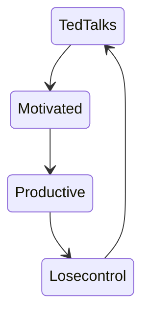

# Ted-Talks

[//]: <> (Diagrama?)

    Analisis Exploratorio de Datos sobre "las ideas que vale la pena difundir"

### [Dataset en Kaggle](https://www.kaggle.com/ashishjangra27/ted-talks)

### [Deploy en Streamlit](https://share.streamlit.io/gilbertonavamarcos/ted-talks/main/viz.py)
