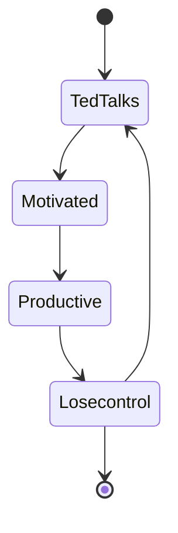

# Ted-Talks

    Analisis Exploratorio de Datos sobre "las ideas que vale la pena difundir"

### [Dataset en Kaggle](https://www.kaggle.com/ashishjangra27/ted-talks)

[//]: <> (Diagrama?)

```mermaid
stateDiagram-v2
    [*] --> TedTalks
    TedTalks --> Motivated
    Motivated --> Productive
    Productive --> Losecontrol
    Losecontrol -->TedTalks 
    Losecontrol --> [*]    
```